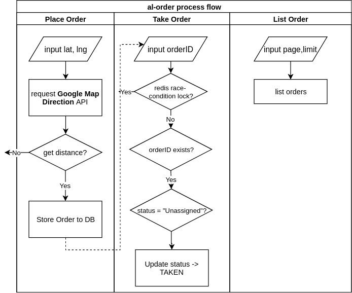

# al-order

## Introduction

`al-order` is a simple demo using Google Map Direction API to simluate the real-world operation of placing order, taking order, and listing orders.

The follow documentation will introduce its usages.

## Quickstart

### Start Container
1. First, clone the repo:
```
git clone https://github.com/DemoHn/al-order
cd al-order
```
2. Before start, make sure your machine is equipped with `docker` and `docker-compose`.
3. Then, copy an `.env` file from `.env.example` by prompting `cp .env.example .env`

__NOTICE:__ since the redis & mysql dependencies are running in docker, the hostname should be `redis`, `mysql` respectively, instead of `localhost`. You don't need to change `DATABASE_URL` and `REDIS_ADDR` in `.env.example` if no special requirement.

You may need to copy your Google Map's Direction API key to `GOOGLE_MAP_APIKEY` in `.env`.

4. Prompt `./start.sh`. This will build up & execute the docker image and its dependencies (`redis`, `mysql`).

### Rebuild image
1. Simply prompt `./build.sh`, which will execute the following command:

```
docker-compose build al-order
```

### Unit Test

unit test is a little bit tricky: it will run `go test` directly on codebase instead of docker image.

1. Before unit test, edit `.env` to replace the original hostname `mysql`, `redis` to `localhost` since we will connect them via host network directly.

2. Simply execute `./test.sh`

### Build without docker
Alternatively, you can build the project without docker.

Before start, make sure your Go version is `>=1.12`.

Then build the project:
```
go build -o ./alorder ./cmd/main.go
```

Which will yield `alorder`, the final executable binary file.

### CLI options
There're 3 options in `alorder`:

- `-host`: server listen host. default is `127.0.0.1`
- `-sqlFile`: sql file for execution before starting server. This is usually for migration. default is `""`.
- `-port`: server listen port. default is `8080`.

## Project Architechture

`al-order` is a typical project using MVC architechture. It consists of 3 layers:

```
 Request     Response
    |          /|\
    |           |
    |           |
   \|/          |      
+--------------------+
|     Controller     |  <---- Validate Input & Handle Response
+--------------------+         +-------+
|      Service       |  <----  | Redis | (using redis for lock Taken)
+--------------------+         +-------+ 
|     DAO (repo)     |  <----> using MySQL for storing data
+--------------------+
```

## Workflow

The following diagram explains the workflow of total 3 operations:



## Error List
All possible errors will be shown here:

| Name | Code | StatusCode | Message |
| :-- | :---: | :--: | ---- |
| ErrIDNotFound | 10000 | 400 | orderID Not Found |
| ErrDBFatal | 10001 | 500 | fatal error: db operation error |
| ErrRedisFatal | 10002 | 500 | fatal error: redis operation error |
| ErrGoogleMapService | 10003 | 500 | fetch google map direction data failed |
| ErrNoRoute | 10004 | 400 | there's no available route from origin -> destination |
| ErrOrderHasTaken | 10005 | 400 | order has been taken by somebody else |
| ErrInputValidation | 10006 | 400 | validate input data failed: xxx |
| ErrUnknownFatal | 11000 | 500 | unknown fatal error |
| ErrGeneralHTTP | 12000 | _not fixed_ | general HTTP error: xx |